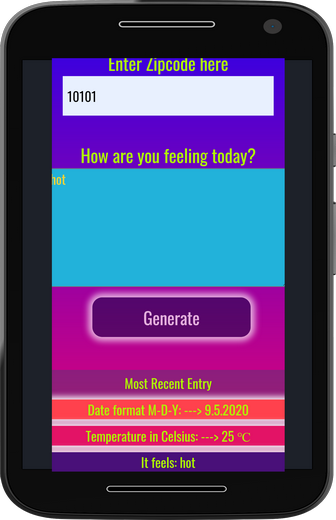

# Weather Journal App Project #2

## Introduction

- This is Version 1.0 of the app please keep intouch for the future improvements.
- Coming soooon.. I intend to make many improvements in the second updated version 1.1 of this app.
- I will work on adding features for searching by city and supporting search by many language along with the zipcode and embeding the forecast logos vectors for each state of the weather, and using the Cooperative asynchronous JavaScript: Timeouts and intervals

## Overview

- This project is an asynchronous web app that uses Web API and user data to dynamically update the UI. The goal of this Udacity project was to begin working with API's, Asyncrounous JavaSCript, Node.JS, and GET/Post Requests.

- This is a Weather Application that allows user to get the actual weather for a place using the zip code from this place.

## Helping resources & What did we learned

- Starter code taken from udacity [repository](https://github.com/udacity/fend/tree/refresh-2019/projects/weather-journal-app).
- First of All the main helping resource was from the Udacity API course itself and by applying what we have learned.
- I am Getting help from a Previous Project but not a palagrism and many more links and websites, and I learned a lot through this project:
- [Previous Project](https://github.com/conordewey3/Udacity-FED-Weather-App)
- [CS50 Course](https://cs50.harvard.edu/web/2020/)
- [Open Weather Map Documentaion](https://openweathermap.org/current#zip)
- [Open Weather Map faq](https://openweathermap.org/faq)
- [Example of using API key in API call](https://openweathermap.org/appid#get)
- [By ZIP code](https://openweathermap.org/current#zip)
- [Anatomy of an HTTP Transaction](https://nodejs.org/en/docs/guides/anatomy-of-an-http-transaction/)
- [Using Promises](https://developer.mozilla.org/en-US/docs/Web/JavaScript/Guide/Using_promises)
- [Understanding the req Object in Express.js](https://www.digitalocean.com/community/tutorials/nodejs-req-object-in-expressjs)
- [Understanding the res Object in Express.js](https://www.digitalocean.com/community/tutorials/nodejs-res-object-in-expressjs)
- [body-parser](https://github.com/expressjs/body-parser)
- [Fetch: Cross-Origin Requests](https://javascript.info/fetch-crossorigin)
- [How to fix Unexpected Token in JSON error (for web developers)](https://www.youtube.com/watch?v=RcEmaTVIE24)
- [Why and when to use API keys](https://cloud.google.com/endpoints/docs/openapi/when-why-api-key)
- [HTTP Status Messages](https://www.w3schools.com/tags/ref_httpmessages.asp)
- [JavaScript Errors - Throw and Try to Catch](https://www.w3schools.com/js/js_errors.asp)
- [Error](https://developer.mozilla.org/en-US/docs/Web/JavaScript/Reference/Global_Objects/Error)
- [throw](https://developer.mozilla.org/en-US/docs/Web/JavaScript/Reference/Statements/throw)
- [How TO - Temperature Converter](https://www.w3schools.com/howto/howto_js_temperature_converter.asp)
- [JavaScript round() Method](https://www.w3schools.com/JSREF/jsref_round.asp)
- [Array](https://developer.mozilla.org/en-US/docs/Web/JavaScript/Reference/Global_Objects/Array)
- [Using Fetch](https://developer.mozilla.org/en-US/docs/Web/API/Fetch_API/Using_Fetch)
- [schemecolor](https://www.schemecolor.com/in-vogue.php)

## The languages used

- HTML
- CSS
- JAVASCRIPT

## Project Dependencies

Node.JS, with cors and bodyparser packages installed. These are included in the package.json. Also an API key from OpenWeatherMap.org is needed.

## Features & Functionalities

- Responsive using CSS Grid and Flexbox.
- Get to the top of the page after refreshthe page
- Weather Information based on http://openweathermap.com/ Current Weather API based on Zip Code Default City USA.
- Back-end Express server with POST and GET route to write and read data.

## Instructions & How to start

- You need to have Node.js and npm locally installed. You can check that by running node -v && npm -v in terminal. This should result in two versions shown in terminal.
- Then, you have to run npm start in order to run the express server locally.
- Open localhost:8000 in your browser and the app will be running.

## Description

- The code in this repository is meant to satisfy the project # 2 rubric of the Web Developer Professional.
- This is a Weather Application that allows user to get the actual weather for a place using the zip code from this place.
